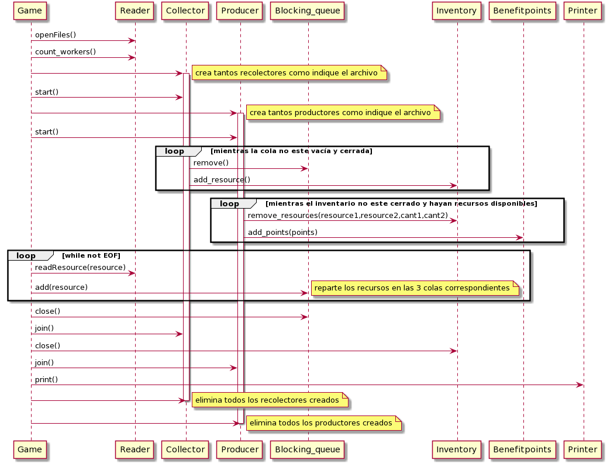

# TP2-Recolectores y Productores

**Apellido y nombre:** Eleonora Luna 
**Padron:** 96444

**Repositorio de Github:** https://github.com/eleonoraluna/tp2.git

## Informe

### 1. Arquitectura General

#### Main principal

Debe recibir dos archivos: el de trabajadores que indica cuál es la cantidad de trabajadores
que tendremos que crear de cada uno y el mapa con la distribución de los recursos.

```
    Ej: ./tp trabajadores.cfg mapa.txt
```

El main se encarga de instanciar un Game y correrlo.

**Clases:**

#### Game

Esta clase se encarga de monitorear el programa en general. Representa al hilo ppal. Hace uso de la clase
Reader para leer el archivo de trabajadores y el mapa. Una vez obtenidas las cantidades de trabajadores se
encarga de spawnearlos y terminarlos de forma ordenada. Tiene una instancia de la clase de
Blocking_queue para cada cola bloqueante utilizada por los recolectores. Allí, va repartiendo
los recursos que lee del mapa con la ayuda de la instancia de la clase Reader. También, tiene
una instancia de la clase Inventory y de la clase Benefitpoints las cuales serán compartidas entre
todos los trabajadores para ir agregando y sacando recursos de allí y sumando los puntos correspondientes.
Por último, hace uso de una instancia de la clase Printer para imprimir los recursos y puntos del inventario.
En el caso de haber tenido algún problema tratando de abrir o parsear los archivos, devuelve 1.

#### Reader

Esta clase se encarga de leer tanto el archivo de trabajadores como el del mapa. Para ello se le pasan
los nombres de cada uno de los archivos y éste se encarga de abrirlos y hacer las operaciones correspondientes
sobre ellos. El archivo de trabajadores lo lee linea a linea y el mapa de a un caracter. Si tiene algún problema
en el parseo devuelve un 1. También devuelve un 1 en caso de que no se haya podido abrir alguno de los archivos.

#### Printer

Se encarga de imprimir los restantes de recursos que quedan en el inventario y los puntos de beneficio
acumulados. Para ello, se lo crea con la instancia de inventario y de puntos de beneficio del Game,
y una vez que los colectores y productores terminaron su trabajo, se llama a la funcion print() para
que imprima todos los datos pedidos.

#### Benefitpoints
Representa un acumulador compartido. Al ser un recurso compartido por los productores se lo encapsuló
en una clase junto con un mutex de manera tal de protegerlo. De esta forma, no puede acceder más de un
productor al mismo tiempo para modificarlo.

#### Inventory
Representa al inventario de recursos que es compartido tanto por los recolectores como por los productores.
Se encuentra protegido por un mutex de tal manera que no hayan dos accesos concurrentes a la instancia.
Para que los productores fuesen avisados de que están disponibles todos los recursos que necesitan, se hizo
uso de una condition variable como podemos ver en la siguiente porción de código:

```c++
int Inventory::remove_resources(int res1,int res2,int count1,int count2){
	std::unique_lock<std::mutex> lock(this->m); //lockea el mutex
	while(!this->available_resources(res1,res2,count1,count2)){
		if(this->isclosed){ //si el inventario esta cerrado(no va a recibir más recursos)
			return 1;   //tengo que salir, no espero más
		}
		this->cond_var.wait(lock); //si no está cerrado el inventario espero a que me despierten
	}
```
A la condition variable se le va a notificar cuando agreguen un recurso o cuando cierren el Inventario (en el
caso de que los recolectores hayan terminado de llenar el inventario). Cuando agregan un recurso, se volverá a 
chequear si se encuentran los recursos que necesitan disponibles. Si es así, se procede a sacar los recursos del 
inventario. En caso contrario,si el inventario fue cerrado, sale de la función y sino sigue esperando a que lo vuelvan a 
notificar. El inventario cuenta con una variable booleana isclosed que se la marca como true si el inventario fue cerrado.

#### Blocking_queue
Esta clase representa las colas que usa cada tipo de recolector. El hilo principal (el Game) se encarga de ir repartiendo
los recursos que lee del archivo en cada cola bloqueante correspondiente y los recolectores acceden para obtener esos
recursos y depositarlos en el inventario. Al tener varios accesos concurrentes a la misma instancia, se decidió encapsular
una cola común en una clase protegida por un mutex. También se hace uso de una condition variable para notificar
cuándo se agrega un recurso a la cola como vemos en la siguiente parte del código:

```c++
char* Blocking_queue::remove(){
      std::unique_lock<std::mutex> lock(this->m);//lockea el mutex
      while (this->myqueue.empty()){//si no hay recursos en la cola
        if (this->isclosed){ //si cerraron la cola(el hilo ppal no tiene más recursos para colocar en ella)
		return NULL;   //salgo de la función
        }
      this->cond_var.wait(lock);   //sino me quedo esperando a que me notifiquen cuando agregan un recurso
```
A la condition variable se le va a notificar cuando agregen un recurso o cuando cierren la cola. En el caso de que la 
cola haya sido cerrada, se sale de la función y se devuelve un *NULL. En cambio, si se agregó un recurso, se procede a
removerlo de la cola y devolverlo.

#### Thread
Clase base de la cual heredan las clases Collector y Producer. Representa un thread que va a ejecutar la funcion run()
detallada en las clases hijas.

#### Collector
Clase que hereda de thread. Representa a los recolectores de recursos. Contiene una referencia a la cola que le
corresponde segun el tipo de recolector que sea y una referencia al inventario. Obtiene recursos de la cola mientras
ésta no este vacía y cerrada, duerme durante 50 ms (para simular trabajo) y agrega el recurso al inventario.

#### Producer
Clase que hereda de thread. Representa a los productores de recursos. Contiene una referencia al inventario y una
referencia al acumulador de puntos de beneficio. Para crearlo se le pasan los recursos que necesita para producir
y en qué cantidades cada uno. Tambíen los puntos que genera por producir. Va a obtener recursos del inventario,
duerme durante 60 ms (para simular trabajo) y si pudo obtener los recursos que necesitaba, suma los puntos
generados al acumulador de puntos de beneficio.

### 2. Diagrama de la solución

A continuación se muestra un diagrama de secuencia de la solución que se implementó.
Si bien no estamos utilizando objetos lo que se intenta mostrar es cómo interactúan los TDAs entre si.


<p align="center">

</p>

